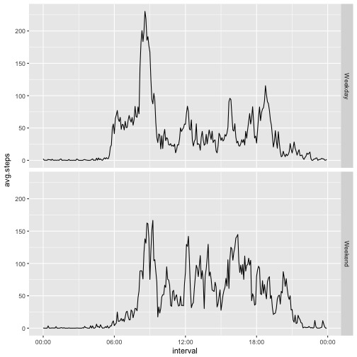

## Reproducible Research Homework 1

It is now possible to collect a large amount of data about personal movement using activity monitoring devices such as a Fitbit, Nike Fuelband, or Jawbone Up. These type of devices are part of the “quantified self” movement – a group of enthusiasts who take measurements about themselves regularly to improve their health, to find patterns in their behavior, or because they are tech geeks. But these data remain under-utilized both because the raw data are hard to obtain and there is a lack of statistical methods and software for processing and interpreting the data.

This assignment makes use of data from a personal activity monitoring device. This device collects data at 5 minute intervals through out the day. The data consists of two months of data from an anonymous individual collected during the months of October and November, 2012 and include the number of steps taken in 5 minute intervals each day.

The data for this assignment can be downloaded from the course web site:  

- Dataset: [Activity monitoring data](https://d396qusza40orc.cloudfront.net/repdata%2Fdata%2Factivity.zip) [52k]

The variables included in this dataset are:

- **steps:** Number of steps taking in a 5-minute interval (missing values are coded as 𝙽𝙰)
- **date:** The date on which the measurement was taken in YYYY-MM-DD format
- **interval:** Identifier for the 5-minute interval in which measurement was taken

The dataset is stored in a comma-separated-value (CSV) file and there are a total of 17,568 observations in this dataset.


#### Code for reading data:

```r
data <- fread("activity.csv")
data <- data %>%  mutate(date=as.Date(date)) %>% 
  mutate(interval=sprintf("%04d", interval)) %>% 
  mutate(interval = as.POSIXct(paste(substr(interval, 1,2), substr(interval, 3,4)), format="%H %M"))
```

#### Histogram of the total number of steps taken each day

```r
plotData <- data %>% group_by(date) %>% summarize(total.steps=sum(steps))
ggplot(plotData, aes(total.steps)) + geom_histogram(na.rm=TRUE)
```

```
## `stat_bin()` using `bins = 30`. Pick better value with `binwidth`.
```


#### Mean and median number of steps taken each day

```r
data %>% group_by(date) %>% 
  summarize(total.steps = sum(steps)) %>% 
  summarize(mean=mean(total.steps, na.rm=T), median=median(total.steps, na.rm=T))
```

```
## # A tibble: 1 x 2
##       mean median
##      <dbl>  <int>
## 1 10766.19  10765
```

#### Time series plot of the average number of steps taken

```r
plotData <- data %>% group_by(interval) %>% summarize(avg.steps=mean(steps, na.rm=T))
ggplot(plotData, aes(x=interval, y=avg.steps)) + geom_line() +
  scale_x_datetime(labels = date_format("%H:%M", tz=Sys.timezone()))
```


#### The 5-minute interval that, on average, contains the maximum number of steps

```r
plotData[which.max(plotData$avg.steps),]$interval
```

```
## [1] "2017-07-23 08:35:00 EEST"
```

#### Code to describe and show a strategy for imputing missing data

```r
data <- data %>% group_by(interval) %>%
  mutate(steps=ifelse(is.na(steps), round(mean(steps, na.rm=T)), steps))
```

Hi#### stogram of the total number of steps taken each day after missing values are imputed


```r
plotData <- data %>% group_by(date) %>% summarize(total.steps=sum(steps))
ggplot(plotData, aes(total.steps)) + geom_histogram(na.rm=TRUE)
```

```
## `stat_bin()` using `bins = 30`. Pick better value with `binwidth`.
```


 
#### Panel plot comparing the average number of steps taken per 5-minute interval across weekdays and weekends


```r
data$weekday <- weekdays(data$date)
plotData <- data %>% group_by(weekday, interval) %>% summarize(avg.steps=mean(steps, na.rm=T))
ggplot(plotData, aes(x=interval, y=avg.steps)) + geom_line() +
  facet_grid(weekday ~ .) +
  scale_x_datetime(labels = date_format("%H:%M", tz=Sys.timezone()))
```


